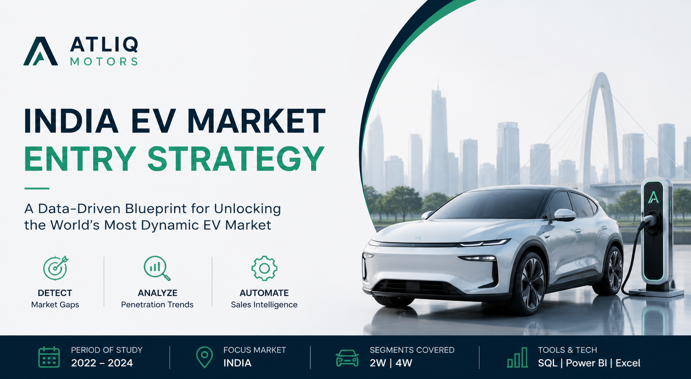

# 🚗 AtliQ Motors: India EV Market Entry Strategy  
### *A Data-Driven Blueprint for Unlocking the World's Most Dynamic EV Market*

<p align="center">
  
</p>

---

## 📌 Project Overview

AtliQ Motors, a US-based automotive leader with a 25% market share in North America, is preparing to enter the Indian EV landscape. This project provides a comprehensive market study (2022–2024) to guide Bruce Haryali, Head of AtliQ Motors India, in executing a successful entry strategy.

**Workflow Strategy:**  
`DETECT` Market Gaps | `ANALYZE` Penetration Trends | `AUTOMATE` Sales Intelligence

---

## 📊 Live Dashboard

🔗 [Live Dashboard](https://app.powerbi.com/view?r=eyJrIjoiNjFlNjdlMzAtNmY0Yy00MjA0LWFjNzAtM2IyNzlmMzc3NzAwIiwidCI6ImM2ZTU0OWIzLTVmNDUtNDAzMi1hYWU5LWQ0MjQ0ZGM1YjJjNCJ9)

---

## 📂 Technical Documentation
### SQL Query Logic & Data Engineering Walkthrough
[](https://1drv.ms/p/c/A12F2CA3782F59B4/IQTrWWE_XfEeQ63tpyWwY4sxAZam4CzTU_WgloEslbAtrz0)


*Click the image above to view the full SQL logic and query documentation.*
##  Project Files (IMPORTANT)

📄 Full Report:  
 [EV project.pdf](./EV%20project.pdf)

📊 Data Model Image:  


📊 States Analysis:  


📊 State Comparison:  


📊 Maker Analysis:  


📊 Filter Pane:  


🎥 Dashboard Video:  


https://github.com/user-attachments/assets/ac05864c-009b-42ae-a976-cff73b189efb


---

##  Objective & Scope

- **Objective:** Conduct a multi-dimensional market study of the Indian EV/Hybrid industry  
- **Methodology:** STAR Method (Situation, Task, Action, Result)  
- **Tech Stack:** SQL, Power BI, Advanced Excel  

---

##  Dataset Understanding

###  dim_date table
- Date range: April 1, 2021 – March 1, 2024  
- Fiscal Year: FY2022 to FY2024  
- Fiscal year starts in April  
- Includes quarterly breakdown  

---

###  EV Sales by State (Fact Table)
-  Monthly recorded data (DD-MMM-YY)  
- State-wise EV sales in India  
- Vehicle Category: 2-Wheeler / 4-Wheeler  
- Electric Vehicles Sold  
- Total Vehicles Sold  

---

###  EV Sales by Makers (Fact Table)
- Monthly recorded data  
-  Vehicle Category: 2W / 4W  
-  Manufacturer name  
-  EVs Sold  

---

##  Key Calculated Metrics

###  Penetration Rate
```
(Electric Vehicles Sold / Total Vehicles Sold) × 100
```

---

### CAGR
```
(Last Year EV Sales / First Year EV Sales)^(1/n) - 1
```

---

###  Penetration Change

- **Absolute Change**  
  = Penetration Rate 2024 − Penetration Rate 2022  

- **Relative Change**  
  = (Difference / Penetration Rate 2022) × 100  

---

##  Data Import Process

- 3 CSV files used initially  
- Additional datasets (charging infrastructure data) added later  

---

##  Dashboard Pages

- Home  
- Makers Analysis  
- States Analysis  
- State-wise Comparison  

---

##  Key Insights from Dashboard

-  EV market in India grew ~50% YoY in CY2023  
-  EVs contribute 6.5% of total vehicle sales  
-  2-Wheelers dominate EV market (56% share)  
-  Electric cars show highest growth (116% YoY)  
- Ola Electric dominates 2W segment  
-  Tata Motors leads 4W segment  
-  BMW shows highest CAGR (1141%) in luxury EV segment  
-  Meghalaya has highest CAGR among states (28.47%)  
-  Maharashtra leads in EV sales + charging infra  
-  Goa has highest penetration but weak infrastructure  

---

##  Advanced Insights

- **High-Growth Segment:** BMW India achieved **1141% CAGR**  
- **State Leader:** Meghalaya leads with **28.5% CAGR**  
- **Seasonal Peak:** March records highest EV sales (~138,343 units in 2024)  

---

##  Strategic Recommendations

| Recommendation | Strategy | Rationale |
| :--- | :--- | :--- |
| Manufacturing Hub | Tamil Nadu | Strong automotive ecosystem |
| Product Focus | Affordable 2W | Highest demand segment |
| Brand Positioning | Innovation-first | Build tech-driven identity |

---

## Author

**Narmatha Annadurai**  
Data Analyst | Specialist in Operational Efficiency  

-  LinkedIn: [Profile](https://www.linkedin.com/in/narmatha-annadurai/)  
-  LeetCode: [narmathaannadurai03](https://leetcode.com/u/narmathaannadurai03/)  
-  Experience: 2.2 Years (Jan 2024 – Feb 2026)  

---
